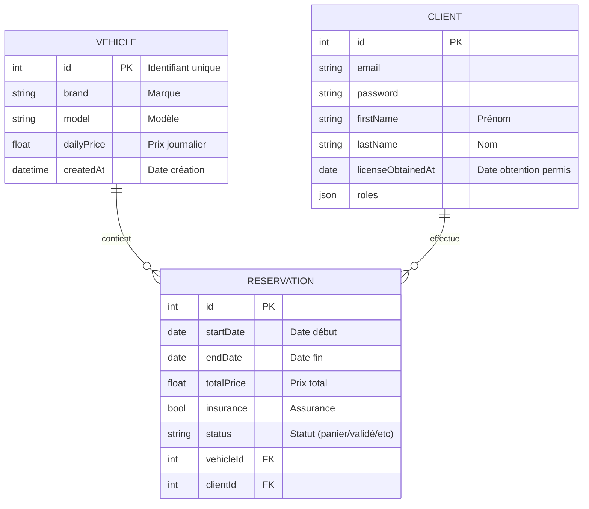

```mermaid
erDiagram
    VEHICLE ||--o{ RESERVATION : "contient"
    CLIENT ||--o{ RESERVATION : "effectue"

    VEHICLE {
        int id PK "Identifiant unique"
        string brand "Marque"
        string model "Modèle"
        float dailyPrice "Prix journalier"
        datetime createdAt "Date création"
    }

    CLIENT {
        int id PK
        string email
        string password
        string firstName "Prénom"
        string lastName "Nom"
        date licenseObtainedAt "Date obtention permis"
        json roles
    }

    RESERVATION {
        int id PK
        date startDate "Date début"
        date endDate "Date fin"
        float totalPrice "Prix total"
        bool insurance "Assurance"
        string status "Statut (panier/validé/etc)"
        int vehicleId FK
        int clientId FK
    }
```